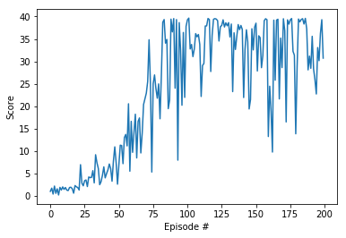

# Training agent for Reacher Environment with Deep RL ( DDPG)

## Overview

This report summarizes the technical implementation of my solution to the Continuous Control Project( for the Reacher environment) implemented using deep reinforcement learning.

My approach consisted of solving the Single Agent version of the environment, and experimenting significantly with the Model and training  architecture and parameters
The agent uses a single threaded implementation of an actor critic approach called Deep Deterministic Policy Gradient, combined with fixed Q targets and  Experience Replay. It is based on the following ( and related) papers:

- **DDPG**: Timothy P. Lillicrap, et al. "Continuous Control control with deep reinforcement learning."

PyTorch, Python and Unity ML Agents environments are used for the implementation, and the documented code is served via Jupyter notebooks in Continous_Control_Train.ipynb and Continous_Control_Train_Inference.ipynb ( for training and inference respectively).

Since the final iteration of the  implementation yielded the best results due to its speed in solving the environment( >=30 score in averaged across last 100 episodes) and a more training performance, this is the approach will be covered in this report.

## Learning Algorithm

The main part of the solution : DDPG agent. is stored in the `ddpg_agent` class/file.  the models for both actor and critic are stored in the "model" class/file.
This agent uses experience replay, with the replay memory stored in the `ReplayBuffer` class, which is stored in the same python file as the agent.
It also uses DDPG actor critic approach, together with the concepts of fixed Q-targets and Double networks. Fixed Q-targets help de-couple the parameters of the network used to predict the correct value, and the network which is being updated, thus reducing harmful co-relation. Double networks and fixed Q targets require two networks with the same structure:  : an online local network for choosing actions and a target Q-network for learning the optimal policy. Both the Actor and Critic networks both have two networks, the target and online local variants.

## DDPG actor critic architecture

The Actor  takes a state as input and maps it to the optimal action to be taken in that state A, while the critic takes both the state and action taken and evaluates its goodness with a Q value  Q(S,A).

Current implementations of both actor and critic use a multi layer perceptron with two hidden layers where each layer has 256 nodes with 
rectified linear unit activation functions for the hidden layers, and a Tanh activation function for the output for the actor.

The complete architecture for the actor and critic are as follows:

Actor:

- Input: 33 nodes (state size)
- Hidden layer 1: 256 nodes
	 - Rectified linear unit activation 
	 -1D batch Normalisation
- Hidden layer 2: 256
	- Rectified linear unit activation
  	- 1D batch Normalisation
- Output layer: Tanh activation function with 4 nodes (the dimensions of the action space))

Critic:

- Inputs:
	- 33 nodes (state size)
	- 4 nodes (dimensions of action size taken by actor)
- Hidden layer 1 ( applied to embed state input): 256 nodes
	 - Rectified linear unit activation 
	 - 1D batch Normalisation
- Hidden layer 2( applied to concatenation of  state embedding and action) : 256
	-  Rectified linear unit activation
- Output layer: 1 node with no activation (to measure Q value)

## Best performing Hyperparameters

| Hyperparameter | Value | Description |
|---|---:|---|
| Replay memory size | 1000000 | Maximum size of experience replay memory |
| Replay batch size | 128 | Number of experiences sampled in one batch |
| Q-network hidden sizes | 256, 256 | Number of nodes in hidden layers of the Q-networks |
| Learning frequency | 1 | Number of steps between learning occurs ( implemented in the code, not as a hyperparameter) |
| Learning  rate  (Actor)| 0.0003 | Controls parameters update of the online local Actor network |
| Learning  rate  (Critic) | 0.0003 | Controls parameters update of the online local Critic network |
| Discount factor | 0.99 | Discount rate for future rewards |
| Soft update factor | 0.001 | Controls parameters update of the target Q-network from the online Q-network |
| Ornstein–Uhlenbeck mean| 0 | the equilibrium value for the OU noise |
| Ornstein–Uhlenbeck sigma | 0.05 |  the degree of volatility around the mean|
| Ornstein–Uhlenbeck theta | 0.15 | the rate of return of the noise to the mean |

The initial value of the parameters were taken from research papers then tweaked based on the empirical results of several experiments. 
The volatility ( sigma) of the OU noise had to be decreased as it impeded learning by causing the agent to take extreme actions. 
Many iterations of the model were attempted, both wider and deeper ones, and it was found that 2 hidden layers with 256 neurons extracts just the right amount of features.
Batch normalization played a big role in helping the agent to learn quickly. The bigger batch_sizes and replay buffer, and target network also helps the agent in the beginning: when rewards are sparse, and it is imperative to replay those trajectories.

The rewards, which are very sparse in the beginning, can be replayed much more efficiently with a prioritised replay buffer.

## Results

The agent was able to solve the environment by achieving score of 30 over 100 consecutive episodes after around 125 episodes.

Rewards plot:

Video of the solution demo:

## Future work

1. Integrating further research work such as Prioritized Replay, parallelized DDPG (with multiple agents).
2. Trying out PPO with reward scaling and surrogate functions.
2. Trying training out on raw pixels.
3. Systematic Hyperparamater tuning using grid/random/bayesian approaches

