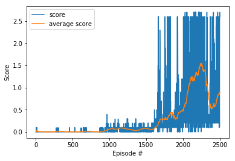

# Training agent for the Tennis Environment with Multi Agent Deep RL ( MADDPG)

## Overview

This report summarizes the technical implementation of my solution to the Multi Agent Collaboration Project (for the Tennis environment) implemented using deep reinforcement learning.

My approach consisted of solving the single threaded version of the environment, and experimenting significantly with the Model and training  architecture and parameters
The environment consists of two agents, each with their own actor and critic, collaboratively solving the environment, using Multi Agent Deep Deterministic Policy Gradient (MADDPG) combined with fixed Q targets and  Experience Replay. It is based on the following ( and related) papers:

- **MADDPG**:  "Multi-Agent Actor-Critic for Mixed Cooperative-Competitive Environments" by Ryan Lowe, et al.
PyTorch, Python and Unity ML Agents environments are used for the implementation, and the documented code is served via Jupyter notebooks in MA_Collaboration-training.ipynb,  and MA_Collaboration-inference.ipynb ( for training and inference respectively).

Since the final iteration of the implementation yielded the best results due to its speed in solving the environment( >0.5 score across the maximum score of the two agents per episode in averaged across last 100 episodes) and a better training performance, and hence this is the approach will be covered in this report.

## Learning Algorithm

The main part of the solution : MADDPG agent. is stored in the `maddpg.py` class/file, which in turn co-ordinates the agent classes "ddpg.py" containing the implementation of the Agents  The models for the actor and critic for both the agents are stored in the "model" class/file.
This agent uses experience replay, with the replay memory stored in the `ReplayBuffer` class, which is stored in the same python file as "maddpg" class. 
It also uses multi agent implementation of the DDPG actor critic approach, together with the concepts of fixed Q-targets and Double networks. Fixed Q-targets help de-couple the parameters of the network used to predict the correct value, and the network which is being updated, thus reducing harmful co-relation. Double networks and fixed Q targets require two networks with the same structure:  : an online local network for choosing actions and a target Q-network for learning the optimal policy. Both the Actor and Critic networks for both agents both have two networks, the target and online local variants.

## MADDPG actor critic architecture ( for both agents)

The Actor for each agent  takes a state as input and maps it to the optimal action to be taken in that state A, while the critic takes the states of both the agents as input, as well as the actions of both the agents  evaluates its goodness with a Q value Q(S,A).

Current implementations of both actor and critic use a multi layer perceptron with two hidden layers with 256 and 128 nodes respectively, 
rectified linear unit activation functions for the hidden layers, and a Tanh activation function for the output for the actor.

The complete architecture for the actor and critic  for each of the two agent id identical and is shown below:

Actor:

- Input: 24 nodes (state size)
- Hidden layer 1: 256 nodes
	 - Rectified linear unit activation 
	 -1D batch Normalisation
- Hidden layer 2: 128
	- Rectified linear unit activation
- Output layer: Tanh activation function with 2 nodes (the dimensions of the action space))

Critic:

- Inputs:
	- 48 ( 24 *2) nodes (state size)
	- 4 nodes (dimensions of action size for both the agents concatenated)
- Hidden layer 1 ( applied to embed state input): 128 nodes
	 - Rectified linear unit activation 
	 - 1D batch Normalisation
- Hidden layer 2( applied to concatenation of  state embedding and action) : 128
	-  Rectified linear unit activation
- Output layer: 1 node with no activation (to measure Q value)

## Best performing Hyperparameters

| Hyperparameter | Value | Description |
|---|---:|---|
| Replay memory size | 1000000 | Maximum size of experience replay memory |
| Replay batch size | 256 | Number of experiences sampled in one batch |
| Q-network hidden sizes | 256, 128| Number of nodes in consecutive hidden layers of the Q-networks |
| Learning frequency | 1 | Number of steps between learning occurs ( implemented in the code, not as a hyperparameter) |
| Learning  rate  (Actor)| 0.0003 | Controls parameters update of the online local Actor network |
| Learning  rate  (Critic) | 0.0003 | Controls parameters update of the online local Critic network |
| Discount factor | 0.99 | Discount rate for future rewards |
| Soft update factor | 0.001 | Controls parameters update of the target Q-network from the online Q-network |
| Ornstein–Uhlenbeck mean| 0 | the equilibrium value for the OU noise |
| Ornstein–Uhlenbeck sigma | 0.05 |  the degree of volatility around the mean|
| Ornstein–Uhlenbeck theta | 0.15 | the rate of return of the noise to the mean |
 | Noise decay | 0.995 | the ratio by which noise decays every episode |
 | Noise min | 0.1| the minimum threshold below which the noise does not drop |
 
The initial value of the parameters were taken from the results of the previous Single Agent Continous Control project and  most of those parameters worked well for this environment as well except for the newer noise decay parameters, which had to be introduced in order to improve performance and introduce stability. This ensured the agent explores more in the beginning and as it learns, it exploits more than explore.
The volatility ( sigma) of the OU noise had to be decreased as it impeded learning by causing the agent to take extreme actions. 
Many iterations of the model were attempted, both wider and deeper ones, and it was found that 2 hidden layers with 256 , 128 neurons extracts just the right amount of features.
Batch normalization played a big role in helping the agent to learn quickly. The bigger batch_sizes and replay buffer, and target network also helps the agent in the beginning: when rewards are sparse, and it is imperative to replay those trajectories.

The rewards, which are very sparse in the beginning, can be replayed much more efficiently with a prioritised replay buffer, which should be implemented in future iterations. Furthermore it was noticed that the agent learnt a little slower than other benchmark implementation so some more hyperparameter tuning, especially around the learning rate, noise, and batch size would help a lot. 

## Results

The agent was able to solve the environment by achieving score of an average of 0.5 across 100 consecutive episodes ( with the maximum of the scores of both agents taken per episode), in 1993 episodes. Then it went ahead and achieved a score of 2.6 in 2500 episode.

Video of the solution demo:

## Future work

1. Integrating further research work such as Prioritized Replay, parallelized MADDPG (with multiple threads).
2. Trying out hyper parameter tuning as highlighted above, using systematic approaches like grid/random/bayesian approaches
3. Exploring other Multi agent  approaches like PPO for more stability.

