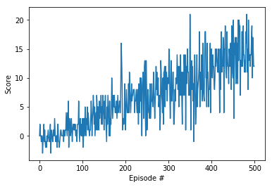

# Training agent for  Banana Collectors Environment with Deep RL

## Overview

This report summarizes the technical implementation of my solution to the Navigation Project ( for the banana collector environment) implemented using deep reinforcement learning.

My approach had two iterations, in which each subequent approach enhances the previous one as follows:

1. Deep Q-network with Fixed Q-targets and Experience Replay
2. Deep Q-network with Fixed Q-targets, Double DQN, Duelling DQN and Experience Replay

It is based on the following papers:

- **DQN**: Mnih, Volodymyr, et al. "Human-level control through deep reinforcement learning."
- **Double DQN**: Van Hasselt, et al. "Deep Reinforcement Learning with Double Q-Learning." .
- **Dueling DQN**- Ziyu Wang, et al. "Dueling Network Architectures for Deep Reinforcement Learning"

PyTorch, Python and Unity ML Agents environments are used for the implementation, and the documented code is served via Jupyter notebooks in Navigation_Train.ipynb and Navigation_Inference.ipynb ( for training and inference respectively).

Since the 2nd iteration of the algorithm yielded the best results due to its speed in solving the environment( >=13 score) and a more training performance, this is the approach will be covered in this report.

## Learning Algorithm

The main part of the solution is the DQN agent implemented in `Agent_v2` class.
This agent uses experience replay, with the replay memory stored in the `ReplayBuffer` class.
It also uses fixed Q-targets in conjuction with Double and Dueling DQNs. Fixed Q-targets help de-couple the parameters of the network used to predict the correct value, and the network which is being updated, thus reducing harmful co-relation. Double DQN reduce the noisy and bias in the beginning of the training process and thus lead to faster and more stable training. Double DQNs and fixed Q targets require two networks with the same structure: online and target Q-networls iimplements fixed Q-targets and Double DQN which require two Q-networks with the same structure: an online network for choosing actions and a target Q-network for learning the optimal policy. Dueling DQN helps in generalizing learning across actions without any change to the other steps.

## Deep Q-network architecture

Q-network Takes a state as input and maps it to the advantage Q-values for each action Q(A)) as well as the value of the entire state (V(S)).

Current implementation uses a dense neural network with two hidden layers where each layer has 64 nodes with 
rectified linear unit activation function. 

The complete architecture is as follows:
 
- Input: 37 nodes (state size)
- Hidden layer 1: 64 nodes
    - Rectified linear unit activation 
- Hidden layer 2: 64 nodes
    - Rectified linear unit activation
- Output layer: 5 nodes (number of actions + 1(for state value))

## Hyperparameters

| Hyperparameter | Value | Description |
|---|---:|---|
| Replay memory size | 100000 | Maximum size of experience replay memory |
| Replay batch size | 64 | Number of experiences sampled in one batch |
| Q-network hidden sizes | 64, 64 | Number of nodes in hidden layers of the Q-networks |
| Learning frequency | 4 | Number of steps between learning occurs |
| Learning  rate | 0.0005 | Controls parameters update of the online Q-network |
| Discount factor | 0.99 | Discount rate for future rewards |
| Target update freq | 1 | Number of learning steps between parameter updates of the target Q-network |
| Soft update factor | 0.001 | Controls parameters update of the target Q-network from the online Q-network |
| Epsilon start | 1.0 | Start value for the epsilon parameter in epsilon-greedy strategy |
| Epsilon end | 0.01 | Final value for the epsilon parameter in epsilon-greedy strategy |
| Epsilon decay | 0.995 | Decrease of the epsilon parameter in epsilon-greedy strategy |

The initial value of the parameters were taken from research papers then tweaked based on the empirical results of several runs.

## Results

The agent was able to solve the environment by achieving score of 13 over 100 consecutive episodes after around 520 episodes.

Rewards plot:

Video of the solution demo:

## Future work

1. Integrating further research work such as Prioritized Replay, distributional DQN, Noisy DQN, rainbow DQN
2. Trying training out on raw pixels.
3. Systematic Hyperperamater tuning using grid/random/bayesian approaches
4. Integrating transfer learning when learning on raw pixels.

